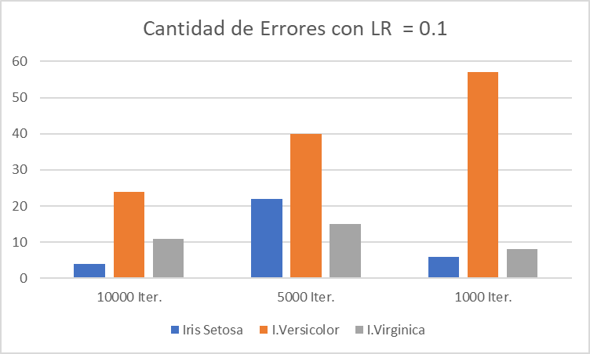
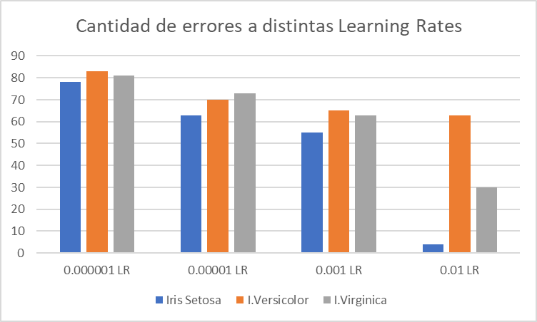
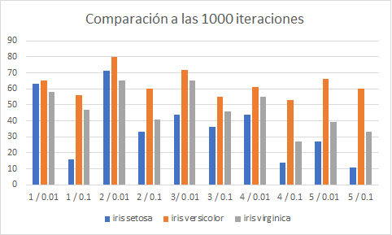
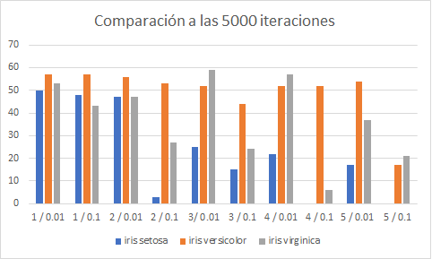
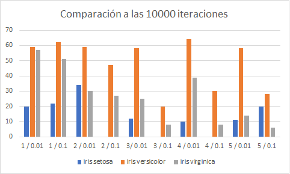
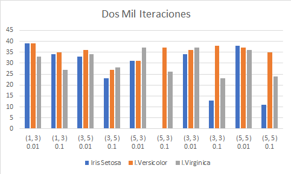
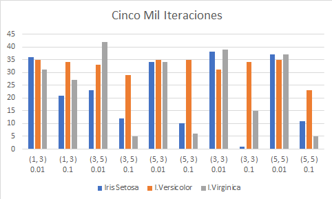
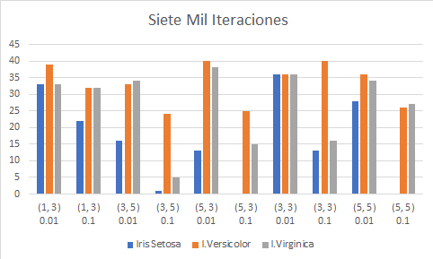
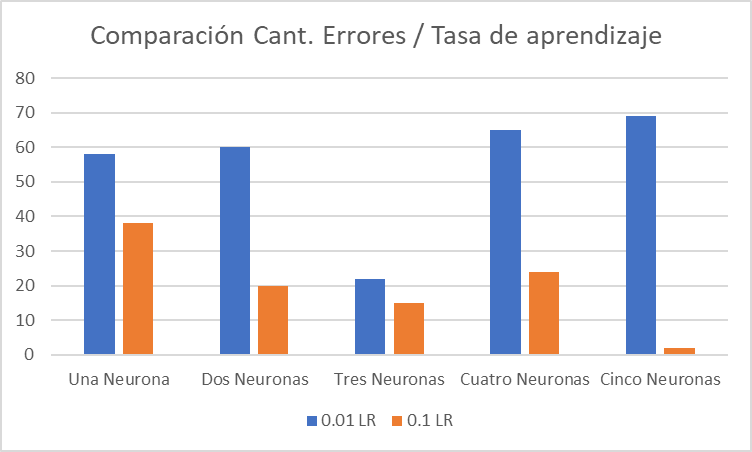
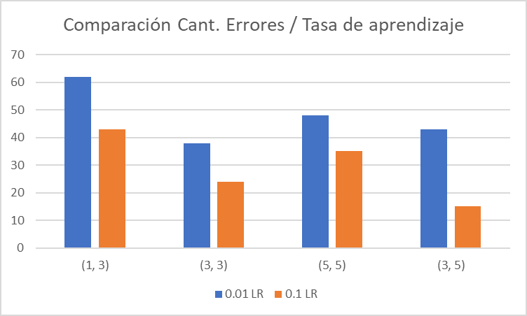

# Clasificador de Especies
## Clasificadores Binarios
Se utilizó el dataframe que contiene $150$ entradas en total. Este fue dividido en tres partes:
* ***iris_setosa***: Valores de Iris Setosa fueron marcados como $1$. Para Iris Versicolor e Iris Virginica fueron marcados como $0$.
* ***iris_versicolor***:  Valores de Iris Versicolor fueron marcados como $1$. Para Iris Setosa e Iris Virginica fueron marcados como $0$.
* ***iris_virginica***:  Valores de Iris Virginica fueron marcados como $1$. Para Iris Versicolor e Iris Setosa fueron marcados como $0$.

Luego, cada una de ellas fue a su vez separado en conjuntos de entrenamiento y prueba con una división de $80%$ y $20%$ respectivamente.

Así, para cada especie, tenemos un conjunto de entrenamiento con $120$ valores y uno de prueba con $30$ valores.

Se utilizó un umbral de $0.5$ para determinar el valor arrojado por la capa de salida de la red neuronal calificaba como $0$ o $1$. Es decir, si el valor arrojado estaba en el rango $[0, 0.5)$, se asume como $0$, mientras que si estaba entre $[0.5, 1]$ se asume como $1$.

### Única Neurona:
Se utilizaron los siguientes valores:
* Tasas de aprendizaje: 1e-06, 1e-05, 0.001, 0.01
* Cantidad máxima de iteraciones: 100000, 10000, 5000, 1000

En total, se crearon siete distintos casos por cada una de las especies del dataframe.

Para calcular el valor mínimo, máximo y promedio de errores, se evaluó cada uno de los casos cinco veces. Es decir, se corrió el algoritmo cinco veces para cada uno de ellos y luego se vió la iteración donde más errores se produjeron, donde menos hubo y el promedio de estas cinco.

En el caso de la tasa de aprendizaje $0.01$, se decidió hacerla con tres distintas cantidades de iteraciones ya que al momento de ejecutarla con $10000$ y ver los datos, nos pudimos dar cuenta de la diferencia de la cantidad de errores entre los casos evaluados previamente y este, por lo que se decidió ver si era posible llegar a mejores resultados con menos iteraciones.

|Especie|Learning  Rate|Max.  Iter|Total  Errores|Min.E.|Max. E.|AVG E.|Total  Falsos  -| Total  Falsos  +
|:-:|:-:|:-:|:-:|:-:|:-:|:-:|:-:|:-:|
|**Iris Setosa**|**1e-06**|**100000**|78|9|27|15.6|42|36|
|**I.Versicolor**|**1e-06**|**100000**|83|13|27|16.6|26|57|
|**I.Virginica**|**1e-06**|**100000**|81|10|19|16.2|20|61|
||
|**Iris Setosa**|**1e-05**|**100000**|63|10|19|12.6|44|19|
|**I.Versicolor**|**1e-05**|**100000**|70|10|20|14|43|27|
|**I.Virginica**|**1e-05**|**100000**|73|12|19|14.6|24|59|
||
|**Iris Setosa**|**0.001**|**10000**|55|1|20|11|12|43|
|**I.Versicolor**|**0.001**|**10000**|65|10|19|13|21|44|
|**I.Virginica**|**0.001**|**10000**|63|4|20|10.75|4|59|
||
|**Iris Setosa**|**0.01**|**10000**|4|0|2|0.8|2|2|
|**I.Versicolor**|**0.01**|**10000**|63|10|20|12.6|43|20|
|**I.Virginica**|**0.01**|**10000**|30|2|11|6|22|8|
||
|**Iris Setosa**|**0.1**|**10000**|4|4|0|0.8|4|0|
|**I.Versicolor**|**0.1**|**10000**|24|7|10|4.8|5|19|
|**I.Virginica**|**0.1**|**10000**|11|1|10|2.2|10|1|
||
|**Iris Setosa**|**0.1**|**5000**|22|0|15|4.4|22|0|
|**I.Versicolor**|**0.1**|**5000**|40|0|8|8|31|9|
|**I.Virginica**|**0.1**|**5000**|15|1|5|3|10|5|
||
|**Iris Setosa**|**0.1**|**1000**|6|0|3|1.2|5|1|
|**I.Versicolor**|**0.1**|**1000**|57|10|13|11.4|51|6|
|**I.Virginica**|**0.1**|**1000**|8|1|3|1.6|2|5|





Es claro por estos resultados que con la tasa de aprendizaje $0.1$ se logra obtener menor cantidad de errores en cada una de las categorías. 

Asimismo, vemos por el gráfico que la menor cantidad de errores se presentan con cinco mil y diez mil iteraciones. Esto posible,ente ocurre ya que para el momento del detenimiento del algoritmo, el margen de error entre la iteración previa y la actual no es lo suficientemente pequeño, por ende no se logran mejores resultados.

### Una Capa Oculta
Al ver los resultados obtenidos previamente, se decidió optar por sólo dos posibles tasas de aprendizaje: $0.01$ y $0.1$, y conocer los valores resultantes al usar tres cantidades máximas de iteraciones: $1000$, $5000$ y $10000$.
Debido al tiempo que toma experimentar con mayor cantidad de neuronas en las capas ocultas y los límites que se tenían, se decidió seguir los consejos dados en clase de experimentar hasta con un máximo de cinco neuronas en la capa oculta. Así, se varió la cantidad en el intervalo [1, 5], resultando finalmente $30$ distintos casos evaluados que se pueden observar a continuación:

|Especie |Learning  Rate|Neuronas  en  Capa  Oculta|Max.  Iter|Total  Errores|Min.  E.|Máx  E.|AVG  E.|Total  Falsos  - |Total  Falsos  +|Max.  Iter|Total  Errores|Min.  E.|Máx  E.|AVG  E.|Total  Falsos  - |Total  Falsos  +|Max.  Iter|Total  Errores|Min.  E.|Máx  E.|AVG  E.|Total  Falsos  - |Total  Falsos  +|
|:-:|:-:|:-:|:-:|:-:|:-:|:-:|:-:|:-:|:-:|:-:|:-:|:-:|:-:|:-:|:-:|:-:|:-:|:-:|:-:|:-:|:-:|:-:|:-:|
|**Iris Setosa**|**0.01** |**1** |**1000** |63 |10 |16 |12.6 |33 |30 |**5000** |50 |1 |13 |10 |50 |0 |**10000** |20 |0 |10 |4 |20 |0 |
|**I.Versicolor**|**0.01** |**1** |**1000** |65 |10 |19 |13 |30 |35 |**5000** |57 |10 |11 |11.4 |57 |0 |**10000** |59 |11 |13 |11.8 |54 |5 |
|**I.Virginica**|**0.01** |**1** |**1000** |58 |10 |17 |11.6 |41 |17 |**5000** |53 |10 |12 |10.6 |53 |0 |**10000** |57 |10 |13 |11.4 |57 |0 |
||
|**Iris Setosa**|**0.01** |**2** |**1000** |71 |10 |20 |74.2 |32 |39 |**5000** |47 |0 |13 |9.4 |47 |0 |**10000** |34 |1 |11 |6.8 |34 |0 |
|**I.Versicolor**|**0.01** |**2** |**1000** |80 |12 |19 |16 |41 |39 |**5000** |56|10 |14 |11.2 |56 |0 |**10000** |59 |10 |13 |11.8 |59 |0 |
|**I.Virginica**|**0.01** |**2** |**1000** |65 |12 |16 |13 |49 |16 |**5000** |47 |3 |11 |9.4 |47 |0 |**10000** |30 |2 |15 |6 |24 |6 |
||
|**Iris Setosa**|**0.01** |**3** |**1000** |44 |0 |12 |8.8 |44 |0 |**5000** |25 |0 |12 |5 |25 |0 |**10000** |12 |0 |12 |2.4 |12 |0 |
|**I.Versicolor**|**0.01** |**3** |**1000** |72 |10 |23 |14.4 |42 |30 |**5000** |52 |10 |12 |10.4 |52|0 |**10000** |58 |10 |13 |11.6 |58 |0 |
|**I.Virginica**|**0.01** |**3** |**1000** |65 |11 |17 |13 |48 |17 |**5000** |59 |10 |15 |11.8 |59 |0 |**10000** |25 |1 |11 |5 |22 |3 |
||
|**Iris Setosa**|**0.01** |**4** |**1000** |44 |0 |20 |8.8 |24 |20 |**5000** |22 |0 |11 |4.4 |22 |0 |**10000** |10 |0 |10 |2 |10 |0 |
|**I.Versicolor**|**0.01** |**4** |**1000** |61 |11 |14 |12.2 |61 |0 |**5000** |52 |7 |14 |10.4 |52 |0 |**10000** |64 |10 |15 |12.8 |64 |0 |
|**I.Virginica**|**0.01** |**4** |**1000** |55 |8 |12 |11 |55 |0 |**5000** |57 |10 |13 |11.4 |57 |0 |**10000** |39 |0 |15 |7.8 |39 |0 |
||
|**Iris Setosa**|**0.01** |**5** |**1000** |27 |0 |15 |5.4 |27 |0 |**5000** |17 |0 |15 |3.4 |17 |0 |**10000** |11 |0 |11 |2.2 |11 |0 |
|**I.Versicolor**|**0.01** |**5** |**1000** |66 |10 |15 |13.2 |50 |16 |**5000** |54|10 |11 |10.8 |54 |0 |**10000** |58 |10 |15 |11.6 |58 |0 |
|**I.Virginica**|**0.01** |**5** |**1000** |39 |3 |10 |7.8 |38 |1 |**5000** |37 |0 |12 |7.4 |37 |0 |**10000** |14 |0 |5 |2.8 |8 |6 |
||
|**Iris Setosa**|**0.1** |**1** |**1000** |16 |0 |13 |3.2 |16 |0 |**5000** |48 |10 |14 |9.6 |48 |0 |**10000** |22 |0 |12 |4.4 |22 |0 |
|**I.Versicolor**|**0.1** |**1** |**1000** |56 |10 |13 |11.2 |56 |0 |**5000** |57|10 |13 |11.4 |57 |0 |**10000** |62 |11 |14 |12.4 |62 |0 |
|**I.Virginica**|**0.1** |**1** |**1000** |47 |10 |14 |9.4 |47 |0 |**5000** |43 |1 |15 |8.6 |43 |0 |**10000** |51 |1 |14 |10.2 |50 |1 |
||
|**Iris Setosa**|**0.1** |**2** |**1000** |33 |10 |12 |6.6 |33 |0 |**5000** |3 |0 |3 |0.6 |3 |0 |**10000** |0 |0 |0 |0 |0 |0 |
|**I.Versicolor**|**0.1** |**2** |**1000** |60 |10 |16 |12 |60 |0 |**5000** |53 |10.6 |8 |13 |52 |1 |**10000** |47 |4 |13 |9.4 |46 |1 |
|**I.Virginica**|**0.1** |**2** |**1000** |41 |2 |13 |8.2 |40 |1 |**5000** |27 |1 |11 |5.4 |24 |3 |**10000** |27 |0 |13 |5.4 |26 |1 |
||
|**Iris Setosa**|**0.1** |**3** |**1000** |36 |0 |14 |7.2 |14 |0 |**5000** |15 |0 |13 |3 |15 |0 |**10000** |0 |0 |0 |0 |0 |0 |
|**I.Versicolor**|**0.1** |**3** |**1000** |55 |10 |12 |11 |55 |0 |**5000** |44 |0 |16 |8.8 |39 |5 |**10000** |20 |0 |11 |4 |20 |0 |
|**I.Virginica**|**0.1** |**3** |**1000** |46 |4 |14 |9.2 |46 |0 |**5000** |24 |0 |12 |4.8 |23 |1 |**10000** |8 |1 |2 |1.6 |5 |3 |
||
|**Iris Setosa**|**0.1** |**4** |**1000** |14 |0 |13 |2.8 |14 |0 |**5000** |0 |0 |0 |0 |0 |0 |**10000** |0 |0 |0 |0 |0 |0 |
|**I.Versicolor**|**0.1** |**4** |**1000** |53 |10 |11 |10.6 |53 |0 |**5000** |52 |1 |16 |10.4 |52 |0 |**10000** |30 |0 |13 |6 |29 |1 |
|**I.Virginica**|**0.1** |**4** |**1000** |27 |1 |11 |5.4 |25 |2 |**5000** |6 |0 |3 |5.2 |3 |3 |**10000** |8 |0 |4 |1.6 |7 |1 |
||
|**Iris Setosa**|**0.1** |**5** |**1000** |11 |0 |10 |2.2 |11 |0 |**5000** |0 |0 |0 |0 |0 |0 |**10000** |20 |0 |11 |4 |20 |0 |
|**I.Versicolor**|**0.1** |**5** |**1000** |60 |11 |13 |12 |56 |4 |**5000** |17 |0 |10 |3.4 |17 |0 |**10000** |28 |0 |12 |5.6 |28 |0 |
|**I.Virginica**|**0.1** |**5** |**1000** |33 |2 |13 |6.6 |31 |2 |**5000** |21 |1 |14 |4.2 |17 |4 |**10000** |6 |0 |3 |1.2 |3 |3 |

Para una mejor visualización de los datos, se anexan los siguientes gráficos:







Al igual que en el caso pasado, mientras mayor es la cantidad de iteraciones, mejor es la calidad de los resultados. Además, con la tasa de aprendizaje $0.1$ se siguen obteniendo menos errores. Sin embargo, el margen entre ambos ahora está menos divididos que al haber una sola capa oculta.

Algo curioso que nuevamente se repite es la variación en la cantidad de errores entre cada una de las especies. A pesar de que los tres datasets utilizados están balanceados, para *Iris Setosa* se obtiene una cantidad de errores mucho menor que para las otras dos especies.

También es importante mencionar la diferencia entre la cantidad de falsos negativos y falsos positivos, siendo estos últimos apenas contables. Esto, además, no carga dependencia con la tasa de aprendizaje, cantidad máxima de iteración o especie.

### Dos Capas Ocultas
Se utilizaron los siguientes valores:
* Cantidad máxima de iteraciones: 2000, 5000, 7000
* Tasas de aprendizaje: 0.01, 0.1
* Cantidad de neuronas en las capas ocultas: (1, 3), (3, 5), (5, 3), (3, 3), (5, 5) 

|Especie |Tasa  de  Aprendizaje|Iteraciones|N.  Neu.  Capa  1|N.  Neu.  Capa  2|Total  Err.|E.  Mín|E.  Máx|AVG  E|Falsos  -|Falsos  +|Iteraciones|Total  Err.|E.  Mín|E.  Máx|AVG  E|Falsos  -|Falsos  +|Iteraciones|Total  Err.|E.  Mín|E.  Máx|AVG  E|Falsos  -|Falsos  +|
|:----------:|:-----------------:|:---------:|:-:|:-:|:-:|:-:|:-:|:-:|:-:|:-:|:-:|:-:|:-:|:-:|:-:|:-:|:-:|:-:|:-:|:-:|:-:|:-:|:-:|:-:|
|**Iris Setosa**|**0.01** |**2000** |**1** |**3** |39 |10 |14 |13 |39 |0 |**5000** |36 |10 |13 |12 |36 |0 |**7000** |33 |10 |12 |11 |33 |0 |
|**I.Versicolor**|**0.01** |**2000** |**1** |**3** |39 |10 |19 |13 |20 |19 |**5000** |35 |10 |14 |11.6 |35 |0 |**7000** |39 |11 |14 |13 |39 |0 
|**I.Virginica**|**0.01** |**2000** |**1** |**3** |33 |11 |11 |11 |33 |0 |**5000** |31 |10 |11 |10.3 |31 |0 |**7000** |33 |10 |13 |11 |33 |0 |
||
|**Iris Setosa**|**0.01** |**2000** |**3** |**5** |33 |10 |13 |11 |33 |0 |**5000** |23 |0 |12 |7.6 |23 |0 |**7000** |16 |0 |15 |5.3 |16 |0 |
|**I.Versicolor**|**0.01** |**2000** |**3** |**5** |36 |10 |14 |12 |36 |0 |**5000** |33 |10 |13 |11 |33 |0 |**7000** |33 |10 |12 |11 |33 |0 |
|**I.Virginica**|**0.01** |**2000** |**3** |**5** |34 |10 |14 |11.3 |34 |0 |**5000** |42 |11 |18 |14 |24 |18 |**7000** |34 |10 |13 |11.3 |34 |0 |
||
|**Iris Setosa**|**0.01** |**2000** |**5** |**3** |31 |10 |11 |10.3 |31 |0 |**5000** |34 |10 |13 |11.3 |34 |0 |**7000** |13 |0 |13 |4.3 |13 |0 |
|**I.Versicolor**|**0.01** |**2000** |**5** |**3** |31 |10 |11 |10.3 |31 |0 |**5000** |35 |10 |14 |11.6 |35 |0 |**7000** |40 |11 |15 |13.3 |40 |0 |
|**I.Virginica**|**0.01** |**2000** |**5** |**3** |37 |11 |14 |12.3 |37 |0 |**5000** |34 |10 |13 |11.3 |34 |0 |**7000** |38 |11 |14 |12.6 |38 |0 |
||
|**Iris Setosa**|**0.01** |**2000** |**3** |**3** |34 |10 |14 |11.3 |34 |0 |**5000** |38 |10 |15 |12.6 |38 |0 |**7000** |36 |10 |13 |12 |36 |0 |
|**I.Versicolor**|**0.01** |**2000** |**3** |**3** |36 |11 |14 |12 |36 |0 |**5000** |31 |10 |11 |10.3 |31 |0 |**7000** |36 |10 |15 |12 |36 |0 
|**I.Virginica**|**0.01** |**2000** |**3** |**3** |37 |11 |14 |12.3 |37 |0 |**5000** |39 |12 |15 |13 |39 |0 |**7000** |36 |10 |15 |12 |36 |0 |
||
|**Iris Setosa**|**0.01** |**2000** |**5** |**5** |38 |11 |14 |12.6 |38 |0 |**5000** |37 |12 |13 |12.3 |37 |0 |**7000** |28 |10 |14 |9.3 |28 |0 |
|**I.Versicolor**|**0.01** |**2000** |**5** |**5** |37 |10 |16 |12.3 |37 |0 |**5000** |35 |10 |14 |11.6 |35 |0 |**7000** |36 |10 |15 |12 |36 |0 |
|**I.Virginica**|**0.01** |**2000** |**5** |**5** |36 |11 |14 |12 |36 |0 |**5000** |37 |10 |14 |12.3 |37 |0 |**7000** |34 |11 |12 |11.3 |34 |0 |
||
|**Iris Setosa**|**0.1** |**2000** |**1** |**3** |34 |10 |12 |11.3 |34 |0 |**5000** |21 |0 |11 |7 |21 |0 |**7000** |22 |0 |12 |7.3 |22 |0 |
|**I.Versicolor**|**0.1** |**2000** |**1** |**3** |35 |10 |14 |11.66|35 |0 |**5000** |34 |10 |13 |11.3 |34 |0 |**7000** |32 |10 |11 |10.6 |32 |0 |
|**I.Virginica**|**0.1** |**2000** |**1** |**3** |27 |0 |14 |9 |27 |0 |**5000** |27 |3 |24 |9 |27 |0 |**7000** |32 |2 |16 |10.6 |32 |0 |
||
|**Iris Setosa**|**0.1** |**2000** |**3** |**5** |23 |0 |12 |7.6 |23 |0 |**5000** |12 |0 |12 |4 |12 |0 |**7000** |1 |0 |1 |0.3 |1 |0 |
|**I.Versicolor**|**0.1** |**2000** |**3** |**5** |27 |2 |13 |9 |27 |0 |**5000** |29 |5 |12 |9.6 |29 |0 |**7000** |24 |0 |13 |8 |24 |0 |
|**I.Virginica**|**0.1** |**2000** |**3** |**5** |28 |4 |13 |9.3 |28 |0 |**5000** |5 |0 |3 |1.6 |5 |0 |**7000** |5 |0 |5 |1.3 |4 |1 |
||
|**Iris Setosa**|**0.1** |**2000** |**5** |**3** |0 |0 |0 |0 |0 |0 |**5000** |10 |0 |10 |3.33 |10 |0 |**7000** |0 |0 |0 |0 |0 |0 |
|**I.Versicolor**|**0.1** |**2000** |**5** |**3** |37 |11 |15 |12.3 |37 |0 |**5000** |35 |10 |15 |11.6 |35 |0 |**7000** |25 |1 |12 |8.3 |23 |2 |
|**I.Virginica**|**0.1** |**2000** |**5** |**3** |26 |2 |12 |8.6 |26 |0 |**5000** |6 |1 |3 |2 |3 |3 |**7000** |15 |2 |10 |5 |13 |2 |
||
|**Iris Setosa**|**0.1** |**2000** |**3** |**3** |13 |0 |13 |4.3 |13 |0 |**5000** |1 |0 |1 |0.3 |1 |0 |**7000** |13 |0 |13 |4.3 |13 |0 |
|**I.Versicolor**|**0.1** |**2000** |**3** |**3** |38 |11 |14 |12.6 |38 |0 |**5000** |34 |10 |12 |11.3 |34 |0 |**7000** |40 |11 |15 |13.3 |40 |0 |
|**I.Virginica**|**0.1** |**2000** |**3** |**3** |23 |3 |10 |7.6 |23 |0 |**5000** |15 |0 |11 |5 |14 |1 |**7000** |16 |2 |11 |5.3 |16 |0 |
||
|**Iris Setosa**|**0.1** |**2000** |**5** |**5** |11 |0 |10 |3.6 |11 |0 |**5000** |11 |0 |11 |3.6 |11 |0 |**7000** |0 |0 |0 |0 |0 |0 |
|**I.Versicolor**|**0.1** |**2000** |**5** |**5** |35 |11 |13 |11.6 |35 |0 |**5000** |23 |1 |12 |7.6 |23 |0 |**7000** |26 |1 |14 |8.6 |26 |0 |
|**I.Virginica**|**0.1** |**2000** |**5** |**5** |24 |2 |11 |8 |24 |0 |**5000** |5 |1 |2 |1.6 |3 |2 |**7000** |27 |3 |13 |9 |27 |0 |







A pesar de haber obtenido mejores resultados previamente con 10000 iteraciones, se decidió bajar la cantidad de las mismas para elaborar una comparación y ver si las dos capas ocultas favorecían la disminución de iteraciones.

Aunque el patrón de obtener mejores resultados con mayor cantidad de iteraciones se sigue repitiendo, es importante mencioanr que, en este caso, la cantidad de errores obtenidas (para ambas tasas de aprendizaje y todas las cantidades de iteraciones evaluadas) disminuyó aproximadamente unos 20 puntos, estando la media entre los 20 y 30 errores por especie, y la mayor cantidad de errores rodeando los 40. 

Nuevamente, los resultados con tasa de aprendizaje $0.1$ siguen siendo mejores. Sin embargo, para la especie *iris versicolor* la variación en su cantidad de errores no es tan grande como para las otras especies.

*Iris Setosa* sigue siendo la especie con menor cantidad de errores, estando esta en varias ocasiones muy por debajo de las otras dos.

## Clasificadores Multiclase

Para la creación de estos clasificadores, se utilizaron los $dummy$ de $Pandas$. De esta manera, se crearon tres nuevas columnas con valores binarios para cada una de las especies que constituían el dataset original.

Al igual que en el caso pasado, se optó por utilizar las tasas de aprendizaje $0.01$ y $0.1$, tanto en 2000 como 5000 iteraciones.

Tal como menciona el enunciado, se utilizó tanto una capa oculta como dos. Para la cantidad de neuronas de la única capa oculta, se tomó el intervalo $1-5$, mientras que para el caso de las dos capas ocultas, se tomaron los siguientes valores: $(1, 3)$, $(3, 3)$, $(5, 5)$, $(3, 5)$.

Es necesario mencionar que el cálculos de los falsos negativos y falsos positivos no se pudo realizar correctamente, y por cuestión de tiempo límite de entrega, no pudo ser acomodado.

A continuación, se presentan los valores dados:

|Tasa de Aprendizaje|Iteraciones|Neu. En Capa|Total Err.|E. Mín|E. Máx|AVG E|Falsos -|Falsos +|
|-------------------|-----------|------------|----------|------|------|-----|--------|--------|
|0.01               |2000       |1           |58        |17    |23    |19.3 |-       |-       |
|0.01               |2000       |2           |60        |17    |22    |20   |-       |-       |
|0.01               |2000       |3           |22        |5     |10    |7.3  |-       |-       |
|0.01               |2000       |4           |65        |13    |27    |21.6 |-       |-       |
|0.01               |2000       |5           |69        |22    |25    |23   |-       |-       |
|                   |           |            |          |      |      |     |        |        |
|0.1                |2000       |1           |38        |2     |26    |12.6 |-       |-       |
|0.1                |2000       |2           |20        |2     |12    |6.6  |-       |-       |
|0.1                |2000       |3           |15        |0     |12    |5    |-       |-       |
|0.1                |2000       |4           |24        |0     |13    |8    |-       |-       |
|0.1                |2000       |5           |2         |0     |1     |0.6  |-       |-       |





Una vez más, la tasa de error $0.1$ sigue siendo aquella que produce mejores resultados, tanto para el caso de una capa oculta como para dos. Esta vez, la diferencia entre ambas es bastante notoria, pues con $0.01$ la cantidad de errores sondea los 60, mientras que con $0.1$ se promedia en 30.

### Comparación con los clasificadores binarios

### Comparación con los clasificadores binarios
Al comparar el rendimiento, los resultados obtenidos por el clasificador multiclase a las dos mil iteraciones con la tasa de aprendizaje $0.01$ (tanto con una capa oculta como en dos), se asemejan a los resultados de los clasificadores binarios con una capa oculta entre las mil y cinco mil iteraciones. Sin embargo, debemos recordar que, en esos casos, la cantidad de errores fue medida por cada una de las especies, mientras que acá la cantidad de errores abarca las tres especies en total. Por ende, sería una menor cantidad de errores por cada especie.

Asimismo, con los clasificadores multiclase utilizando la tasa de aprendizaje $0.1$ a 2000 iteraciones, fue que se obtuvo los mejores resultados de todos los experimentos. 

Aún así, esto no significa que uno de los clasificadores sea mejor que otro, sino que están destinados para causas distintas. Para el caso de una clasificación que va más allá de un *pertenece* o *no pertenece*, es mejor utilizar clasificadores multiclase, mientras que para esos casos donde la evaluación es simplemente un *sí* o *no*, los clasificadores binarios son los indicados.

Dicho esto, para poder realizar una mejor comparación es necesario hacer más pruebas, especialmente con más cantidades máximas de iteraciones para los clasificadores multiclase.

# 3:  Clasificación de spam

Para el clasificador de spam se normalizaron los datos de las últimas 3 columnas de entrada,  capital_run_length_average, capital_run_length_longest y capital_run_length_total

Se dividieron los experimentos en 2 partes, experimentos de topologías y experimentos de tasa de aprendizaje

## Topologías

Se probó con distintas combinaciones de profundidades y anchos homogéneos de capas internas en intervalos de 10. Es decir

```[1, 10, 20, 30, 40, 50, 60] capas internas x [1, 10, 20, 30, 40, 50, 60, 70, 80, 90, 100] neuronas por capa interna```

Se probaron estas combinaciones con los siguientes parámetros

* Iteraciones: 50 
* Tasa de aprendizaje: 0.00001

En la siguiente gráfica se pueden visualizar los resultados

.

Los 10 menores errores fueron

|Profundidad | Ancho | tasa de error |
|:----------:|:-----------------:|:---------:|
|**20**|**80**|0.24188783454962035|
|**40**|**20**|0.2500841894396112|
|**50**|**30**|0.251263287441727|
|**70**|**10**|0.2519126044142899|
|**50**|**90**|0.25215961688326183|
|**10**|**40**|0.25218344612988064|
|**60**|**90**|0.25624042195836866|
|**30**|**60**|0.256961442645613|
|**40**|**70**|0.2601737903367856|
|**10**|**1**|0.2610052077226626|


Se tomó la topología de 20 capas ocultas de 80 neuronas cada una para continuar los experimentos

## Tasas de aprendizaje

Se tomó el modelo obtenido en la sección anterior (con 50 iteraciones de entrenamiento, que no son tomadas en cuenta en esta sección) y sobre este se realizaron 5 sesiones de entrenamiento der 500 iteraciones con las tasas de aprendizaje (0.00001, 0.000005, 0.00002, 0.00003, 0.00006). Se grafica el resultado del entrenamiento total con cada sesión identificada como un segmento específico de la gráfica


Se puede observar que para las pruebas hechas aumentar la tasa de aprendizaje resultó en una mejora de los resultados de cada entrenamiento.

la tasa de error final conseguida en el entrenamiento fue de 0.2387
